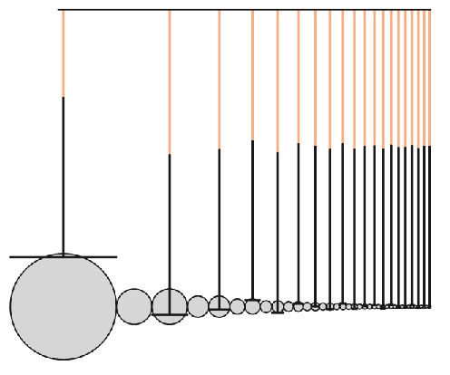
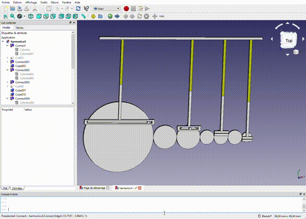
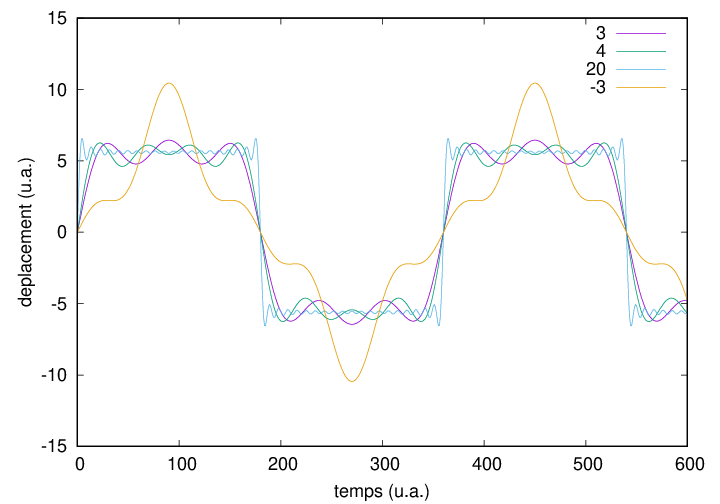

# harmonic analyzer simulator in FreeCAD

Inspired by B. Hammack's video on the harmonic analyzer entitled "An Old Mechanical Computer: The Harmonic Analyzer" 
[https://www.youtube.com/watch?v=GyYflzRVu6M] (accessed Dec. 2019) and J.G. Egas Ortuno's video entitled "FreeCAD animation 
how" at [https://www.youtube.com/watch?v=BHbnOlBvpLI] (accessed Dec. 2019)



Model created by create.py with 20 harmonics (i.e. 20 wheel pairs)



Animated motion with 4 gears (=harmonics, manual drawing)



Pen motion when considering 3, 4 or 20 harmonics, and when forgetting (-3) an intermediate wheel making the even wheel rotate in the opposite direction than the odd wheels (incorrect sum of harmonics).

This was tested with FreeCAD 0.18 (released 2019/10/22)

# Videos of the running simulations

I've captured videos of the simulations running: they are located in the video subdirectory, but seem to have to be downloaded and cannot be played from github raw display.

# Running the simulation

## Basic model

When using a ready made FreeCAD model:

1/ load the .FCStd model

2/ open the Python console (View → Panels → Python console menu) and type

```python
import os
os.chdir('/home/myuser/directory')
import script
```
assuming the program named script.py is located in the /home/myuser/directory directory

For re-loading the script (e.g. after modifying the Python program):
```python
import importlib
importlib.reload(script)
```

For the example creating the model in addition to running the simulation: create an empty FreeCAD project, and
```python
import os
os.chdir('/home/myuser/directory')
import create
```
to run the create.py script. This script uses the nbharmonics (default value=20) to define how many harmonics are created.

When running this script, a file named "res" will be created in the current directory, whose last column can be displayed (e.g. with gnuplot) for showing the motion of the pen.

## Model with gears

If the FCGear workbench has been installed, a model that could be build replacing flat cylinders with gears
can be created with
```python
import create_gears_holes
```
